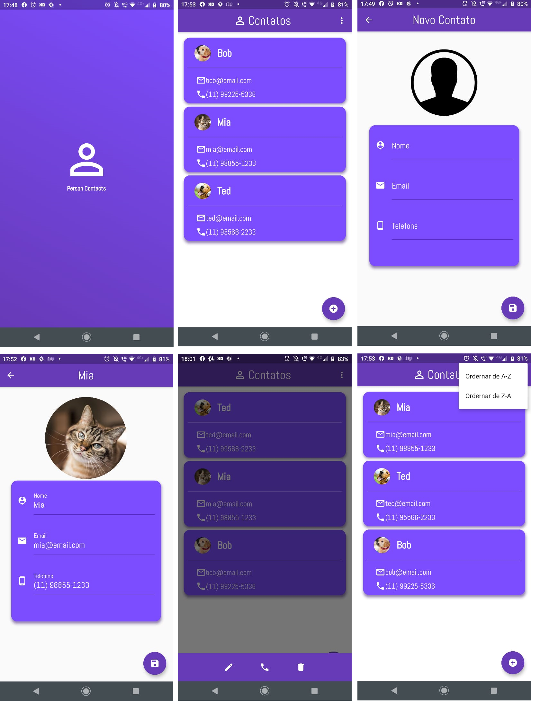

# Agenda de Contatos
Agenda de contatos em *flutter* utilizando a linguagem *dart*

## Funcionalidades
 - Utilização de Banco de Dados para armazenamento
 - Efetuar Ligações
 - Utilizar Camera e Galeria do Celular

## Screenshots

### Widgets
 - Card
 - ListTile
 - Navigator
 - GridView
 - GestureDetector
 - Scaffold
 - CircleAvatar

### Dependências Extras
  - sqflite: ^1.1.5
  - sqflite_migration: ^0.2.0
  - url_launcher: ^5.7.2
  - image_picker: ^0.6.7+11
  - google_fonts: ^1.1.0
  - mask_text_input_formatter: ^1.1.0
  - splashscreen: ^1.2.0

